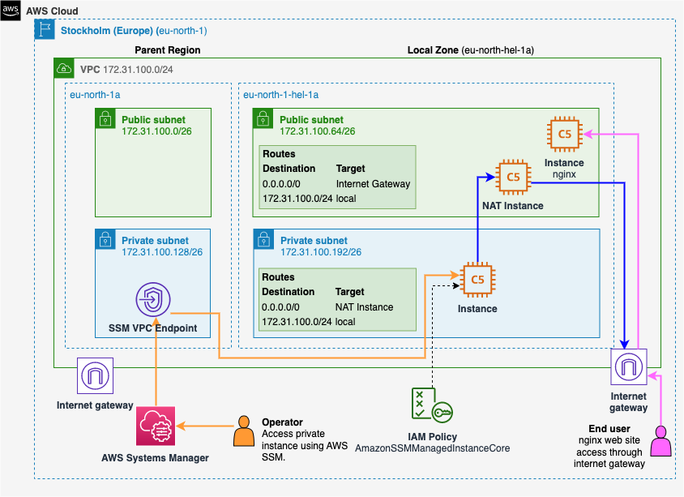
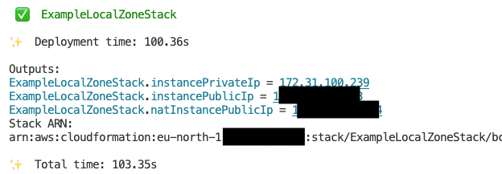
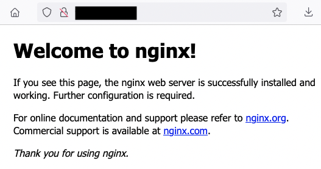
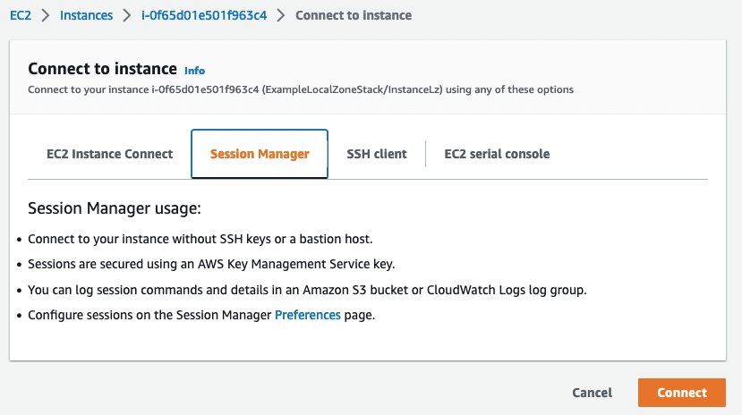

# EC2 deployment to AWS Local Zone with AWS Systems Manager support using AWS CDK

This an example of an EC2 instance deployed to an AWS Local Zone of your choice.
A new VPC will be created containing subnets in the parent region and in the Local Zone.

**Note** This example does not use NAT Gateway or ALB because support is limited in Local Zones. See [AWS Local Zones features](https://aws.amazon.com/about-aws/global-infrastructure/localzones/features/?nc=sn&loc=2) from AWS documentation and for details about which services are provided in each Local Zone.

When deploying to a Local Zone, a supported instance type and EBS volume (`gp2` in most regions) type must be used.

You can check the instance offering with AWS CLI: `aws ec2 describe-instance-type-offerings --location-type "availability-zone" --filters Name=location,Values=eu-north-1-hel-1a --region eu-north-1`. Replace the zone name and region name with your own. In the examples, Amazon Linux 2022 is being used as an image:

```ts
// Choose a supported instance type in example-localzone-stack.ts
const instanceType = ec2.InstanceType.of(ec2.InstanceClass.COMPUTE5, ec2.InstanceSize.XLARGE2);
```

Amazon Linux 2022 defaults to `gp3` volume, it needs to be replaced with `gp2` manually:

```ts
blockDevices: [{
    deviceName: '/dev/xvda',
    volume: ec2.BlockDeviceVolume.ebs(8, {
    encrypted: true,
    volumeType: ec2.EbsDeviceVolumeType.GP2,
    }),
}],
```

[AWS Systems Manager](https://docs.aws.amazon.com/systems-manager/latest/userguide/systems-manager-setting-up.html) can be used to connect to the instances for administrative actions.

## Build and test

To build this app, you need to be in this example's root folder. Then run the following:

```sh
npm install -g aws-cdk
npm install
```

This will install the latest version of CDK and other dependencies.

Then verify that the snapshot test succeeds:

```sh
npm run test
```

## Deploy

First, edit and configure the region and local zone in `example-localzone-stack.ts`.

Run `cdk deploy`. This will deploy or update the stack on the active AWS account. `cdk destroy` can be used to remove the deployed resources after they are no longer needed.

## What do we have here

### Public instance running nginx

This is only for demonstration purposes. The instance is placed in a public subnet and allows connections to port 80 and serves the nginx default page. This can be further improved by adding SSL termination or load balancing for multiple backends.

The instance uses a custom role which allows AWS Systems Manager to be used for doing maintenance work on it.

### NAT Instance

Since NAT Gateway is not supported in Local Zones at the moment, a [NAT instance](https://docs.aws.amazon.com/vpc/latest/userguide/VPC_NAT_Instance.html) can be used to route traffic to the internet from the private subnet.

The private subnet in the Local Zone is configured with a default route to the NAT instance:

```ts
vpc.selectSubnets({
  subnetType: ec2.SubnetType.PRIVATE_ISOLATED,
  availabilityZones: [LOCAL_ZONE_AZ],
}).subnets.forEach(s =>
  (s as ec2.PrivateSubnet).addRoute('Internet', {
  routerId: natInstance.instanceId,
  routerType: ec2.RouterType.INSTANCE,
  destinationCidrBlock: '0.0.0.0/0',
  enablesInternetConnectivity: true,
}));
```

### Private instance

A private instance that cannot be accessed from the public internet. AWS Systems Manager can be used for configuration work. The instance can access public internet using a route through the NAT instance.

### Putting it all together

The architecture diagram how the VPC address space is divided between the subnets. VPC Endpoint for the AWS Systems Manager must be located in the parent region.



After the deoloyment you will see the stack outputs which contains the URLs of the three instances:



You can verify the deployment of nginx by opening the address in the browser:



To connect to the private instance (or the public instances), use AWS Systems Manager in the AWS Console to open a shell:


